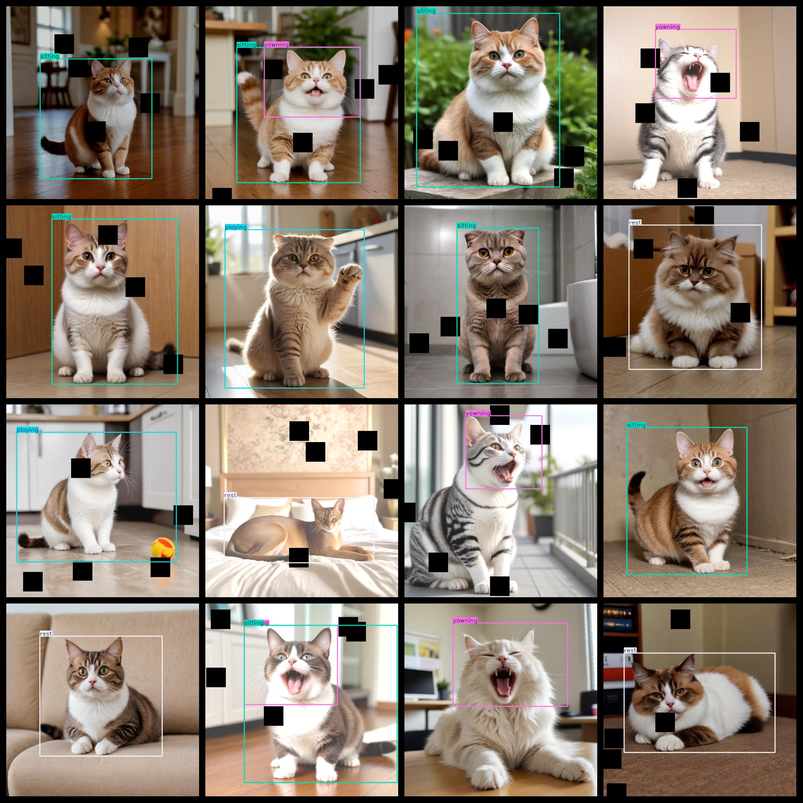
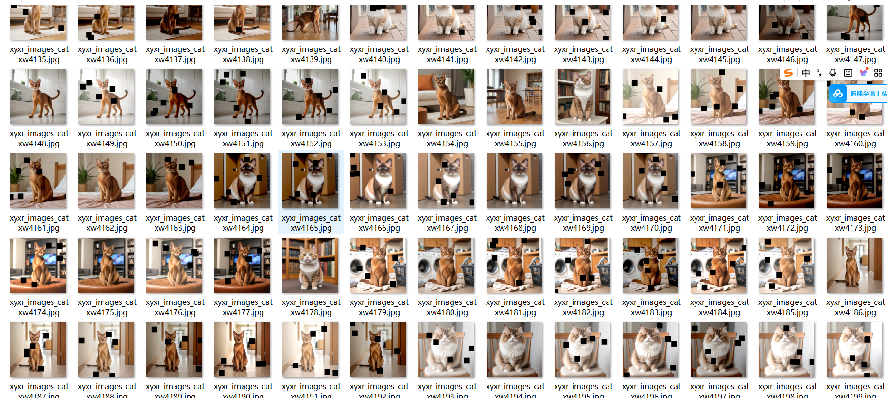

# [Object Detection] Cat Behavior Detection Dataset 5739 imagesYOLO+VOC format

【Target Detection】Cat Behavior Detection Dataset: 5739 YOLO+VOC Format

According to the format: VOC format + YOLO format.

The compressed file contains: three folders, each storing images, xml files, and text files.

Total jpg images in JPEGImages folder: 5739

The total number of xml files in the Annotations folder is: 5739.

The total number of txt files in the labels folder is 5739.

Number of tag types: 6

Tag names: ["eating","playing","rest","sitting","stretching","yawning"]

The number of boxes for each label (Note that the order of labels in the Yolo format does not correspond to this, but is based on the classes.txt file in the labels folder):

eating frame count = 139

playing frame count = 320

rest frame count = 2077

sitting frame count = 2437

stretching frame count = 1

yawning frame count = 1183

Total boxes: 6157

Picture clarity (Resolution: Pixels): Clear

Images augmented: No

Shape of the label: Rectangular box, used for object detection and recognition.

Annotation and image details are as follows:

## Images

---

Here is a pay link on Stripe (https://buy.stripe.com/3cs8yP7sY87d0vu9AB). Please contact me lonlonago@foxmail.com after funding $89, and I will send you a complete data files, thank you!

